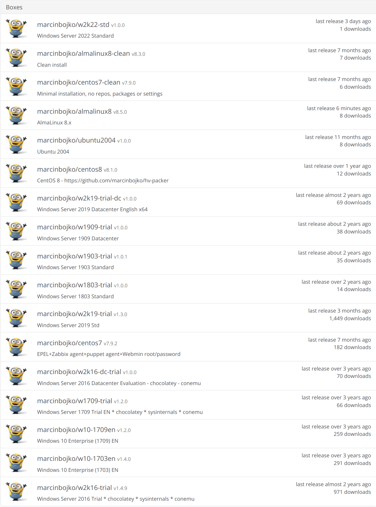

# vagrant-boxes
<!-- TOC -->

- [vagrant-boxes](#vagrant-boxes)
  - [Vagrant required plugins](#vagrant-required-plugins)
  - [Default providers](#default-providers)
  - [Default credentials](#default-credentials)
    - [Linux](#linux)
    - [Windows](#windows)
  - [Boxes available in Vagrant Cloud](#boxes-available-in-vagrant-cloud)
  - [Linux boxes](#linux-boxes)
    - [CentOS 7](#centos-7)
    - [Alma Linux 8](#alma-linux-8)
    - [Alma Linux 9](#alma-linux-9)
      - [Alma Linux 9 - arm64](#alma-linux-9---arm64)
    - [Rocky Linux 8](#rocky-linux-8)
    - [Rocky Linux 9](#rocky-linux-9)
      - [Rocky Linux 9 - amd64](#rocky-linux-9---amd64)
      - [Rocky Linux 9 - arm64](#rocky-linux-9---arm64)
    - [Oracle Linux 8](#oracle-linux-8)
    - [Oracle Linux 9](#oracle-linux-9)
      - [Oracle Linux 9 - arm64](#oracle-linux-9---arm64)
    - [Ubuntu 20.04 LTS Server](#ubuntu-2004-lts-server)
    - [Ubuntu 22.04 LTS Server](#ubuntu-2204-lts-server)
      - [Ubuntu 22.04 LTS Server - arm64](#ubuntu-2204-lts-server---arm64)
  - [Windows boxes](#windows-boxes)
    - [Windows Server 2016 Standard](#windows-server-2016-standard)
    - [Windows Server 2019 Standard](#windows-server-2019-standard)
    - [Windows Server 2019 Datacenter](#windows-server-2019-datacenter)
    - [Windows Server 2022 Standard](#windows-server-2022-standard)
    - [Windows Server 2022 Datacenter](#windows-server-2022-datacenter)
  - [ToDo](#todo)

<!-- /TOC -->

Set of Vagrant Boxes for different OS'es

## Vagrant required plugins

```bash
vagrant plugin install sahara
vagrant plugin install vagrant-reload
```

## Default providers

- Virtualbox
- Hyper-V (2016/2019)
- Parallels Desktop (ARM64 Based Machines)

## Default credentials

### Linux

```ini
root:password
vagrant:vagrant
```

### Windows

```ini
Administrator:password
vagrant:vagrant
```

## Boxes available in Vagrant Cloud

[https://app.vagrantup.com/marcinbojko](https://app.vagrantup.com/marcinbojko)



## Linux boxes

### CentOS 7

|name|version|
|----|-------|
|centos7|7.9.3|

### Alma Linux 8

|name|version|
|----|-------|
|almalinux8|8.5.2|

### Alma Linux 9

#### Alma Linux 9 - arm64

|name|version|
|----|-------|
|almalinux9-arm64|9.0.1|

### Rocky Linux 8

|name|version|
|----|-------|
|rockylinux8|8.5.1|

### Rocky Linux 9

#### Rocky Linux 9 - amd64

|name|version|
|----|-------|
|rockylinux9|9.0.0|

#### Rocky Linux 9 - arm64

|name|version|
|----|-------|
|rockylinux9-arm64|9.1.1|

### Oracle Linux 8

|name|version|
|----|-------|
|oraclelinux8|8.5.2|

### Oracle Linux 9

#### Oracle Linux 9 - arm64

|name|version|
|----|-------|
|oraclelinux9-arm64|9.1.0|

### Ubuntu 20.04 LTS Server

|name|version|
|----|-------|
|ubuntu2004|1.1.0|

### Ubuntu 22.04 LTS Server

|name|version|
|----|-------|
|ubuntu2204|1.1.0|

#### Ubuntu 22.04 LTS Server - arm64

|name|version|
|----|-------|
|ubuntu2204_arm64|22.04.20221108|

## Windows boxes

### Windows Server 2016 Standard

|name|version/box|
|----|-------|
|win2016std|1.4.9|

### Windows Server 2019 Standard

|name|version/box|
|----|-------|
|win2019std|1.1.0|

### Windows Server 2019 Datacenter

|name|version/box|
|----|-------|
|win2019std|1.4.0|

### Windows Server 2022 Standard

|name|version/box|
|----|-------|
|win2022std|1.1.0|

### Windows Server 2022 Datacenter

|name|version/box|
|----|-------|
|win2022dc|1.0.0|

## ToDo

- Add more boxes from a list
- Add more scripts from a list
